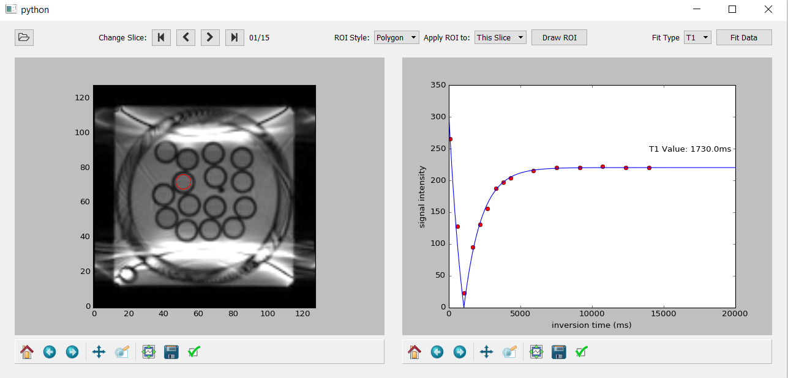

# bloodtools
Tools for plotting T1 and T2 relaxation curves of blood as measured using SSFP T1/T2 sequences on Siemens MRI scanners.

# Features:
1. Simple ROI selection tool allows you to specify arbitrary polygon, circular or elliptical ROIs quickly.
2. Automatic fitting tool fits the T1 or T2 recovery curve and displays the T1 value.

# Setup:
1. Install the full version [Anaconda, the scientific python distribution](https://www.continuum.io/downloads)
2. Open a command line and run:
$ pip install pydicom
3. Open Spyder, or your preferred command line tool and run blood_relax_tool.py

# Further Work / Coming Soon
1. Added support for dicoms from other MRI scanners
2. Inclusion of more advanced T2 recovery fit methods that better address the MRI scanner's noise floor when fitting longer echo timings.
3. Adjustable color map and window intensity adjustments.